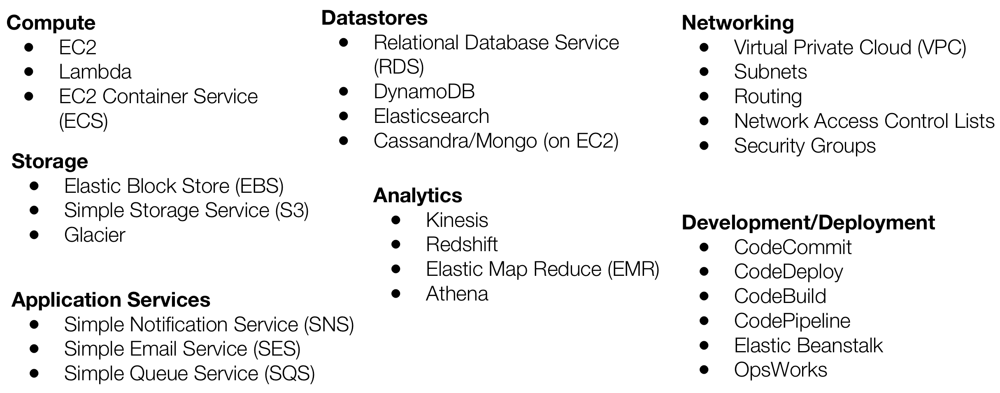
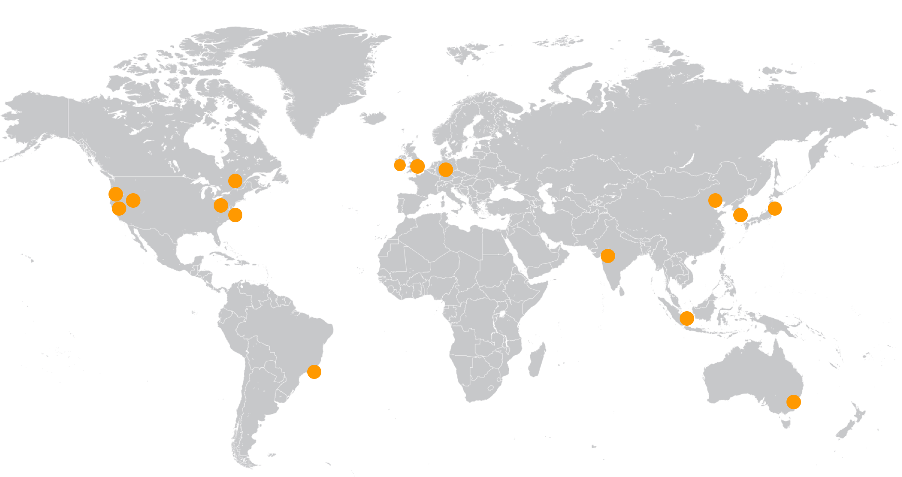
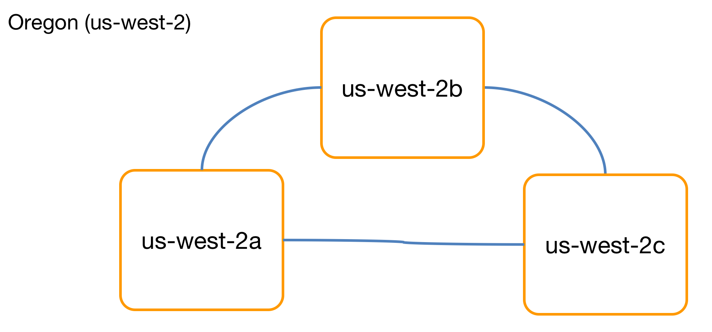

## Getting Started With Amazon Web Services (AWS)

---

# Agenda

- Fundamental concepts
- AWS Acronyms
- What are the services?
- Why do we use them?
- What are some use cases?

---

> Foundational Concepts

---

# What is Cloud !

---

# Service Models

---

# Deployment Models

---

> Amazon Web Services (AWS)

---

---
## Regions

---
## Availability Zones

---
## Edge Locations

---
> Identity and Access Management

---

## IAM Overview

---

## Users and Groups

---

## Policies

--- 

## Roles

---

## Federated Users

---
## IAM Best Practices

- Root credentials
	- Email address + password
	- Protect at all costs
 	- Do not use for day-to-day
- Follow principle of least privilege
- Rotate access keys
- Enable Multi-Factor Authentication (MFA)
- Do not share credentials!

---

## AWS New Account First Steps

- Create an admin user in IAM
- Enable Multi-Factor Authentication on root account
- Enable Cost and Usage Report
- Log out of root account
- Log in with admin user
- Create additional users, groups, etc 

---

> Networking

---
## Amazon Virtual Private Cloud (VPC)

---
## Subnets

---
## Routing

---
## Network Access Control Lists

---
## Security Groups

--- 
## Amazon Route 53

---
> Compute Services

---
## Amazon Elastic Compute Cloud (EC2)

---
## AWS Lambda

---
## Amazon EC2 Container Service

---

> Storage Services

---
## Amazon Elastic Block Store (EBS)

---
## Amazon Simple Storage Service (S3)

---
## Amazon Glacier

---
> Datastore Services

---
## Amazon Relational Database Service (RDS)

---
## Amazon DynamoDB

---
## Amazon ElastiCache

---
> Reliability

---
## Elastic Load Balancing

---
## Auto Scaling

---
## AWS CloudFront

---
>Security

---
## Shared responsibility model

---
## Resource-based Permissions

---
## AWS CloudTrail

---
## AWS Key Management Service (KMS)

---
## AWS Certificate Manager

---
> Deployment

---
## Infrastructure as Code

---
## AWS CloudFormation

---
## AWS Elastic Beanstalk

---
## AWS OpsWorks

---
> Monitoring & Logging

---
## Amazon CloudWatch

---
## Amazon CloudWatch Logs

---
> Analytics

---
## Amazon Kinesis

---
## Amazon Redshift

---
## Amazon EMR

---
> That’s All Folks :)
