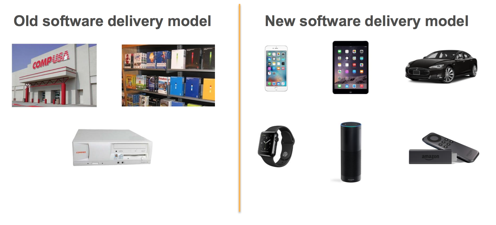

## Effective
# [fit] DevOps

---

# [fit] What Is DevOps?

---

## [fit] Its reinventing,
## [fit] how we 
## [fit] run our businesses!!

---

## A little bit about software release processes..

## [fit] RELEASE PROCESSES HAVE FOUR MAJOR PHASES
**Source, Build, Test, Deploy**
## [fit]Always Constant
---

# THE SOFTWARE DELIVERY MODEL HAS DRASTICALLY CHANGED..

---

## [fit] SOFTWARE MOVES FASTER TODAY

**Your ability to move fast is paramount to your ability to fight off disruption**

---

# Lets start moving quickly..

---

---

 
 ---

---

# [fit] Retrospection

---

---

---

---

> Fear is the path to the dark side. Fear leads to anger. Anger leads to hate. Hate leads to suffering. – Yoda

---

# [fit] WHAT NOT IS DEVOPS?

---

## [fit] It’s Not NoOps
## [fit] It’s Not (Just) Devs and Ops
## [fit] It’s Not (Just) A Job Title

---

# [fit] WHAT IS DEVOPS?

---

---

---

---

---

---

## [fit] Its all about...

---

## [fit] Blended or Shared Responsibilities 
## [fit] Blameless Postmortems
## [fit] Speed vs Stability

---

# [fit] 7 Habits of Highly Effective DevOps!

--- 

## [fit] Be Proactive.
## [fit] Begin with the end in mind.
## [fit] Put First Things First.
## [fit] Think Win - Win.
## [fit] Seek first to understand, then be understood.
## [fit] Synergize.
## [fit] Sharpen the saw.

---

## Make your titles fill the screen.

### _Note:_ This only works if you have nothing but headlines on a slide. Otherwise things are going to start looking ridiculous.