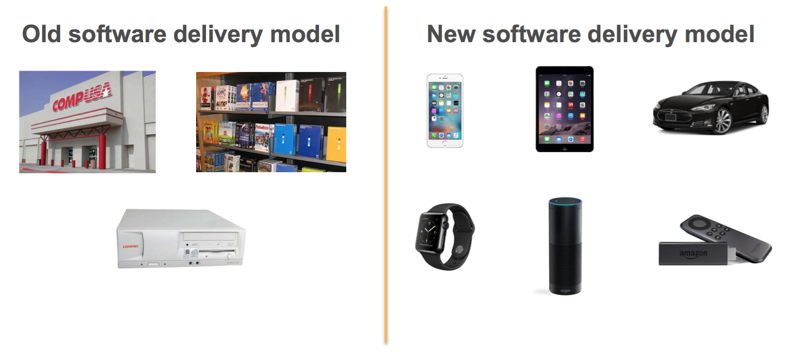

## Effective
# [fit] DevOps

---

## A little bit about software release processes..

## [fit] RELEASE PROCESSES HAVE FOUR MAJOR PHASES
**Source, Build, Test, Deploy**
## [fit]Always Constant
---

# THE SOFTWARE DELIVERY MODEL HAS DRASTICALLY CHANGED..

---

## [fit] SOFTWARE MOVES FASTER TODAY

**Your ability to move fast is paramount to your ability to fight off disruption**

---

# [Fit] Lets Do DevOps!!

> It is not the strongest of the species that survives, nor the most intelligent that survives. It is the one that is most adaptable to change. – Charles Darwin

---

# [fit] What Is DevOps?

---

## [fit] Its reinventing,
## [fit] how we 
## [fit] run our businesses!!

---

## [fit] Its all about...

---

## [fit] Blended or Shared Responsibilities 
## [fit] Blameless Postmortems
## [fit] Speed vs Stability

---
# Culture
## Automation 
## Measurement
## Sharing

---

# [fit] 7 Habits of Highly Effective DevOps!

---

## 1. Be Proactive
### Change Happens Constantly!!

---

##[fit] Information is imperfect
##[fit] Everyone makes mistakes
##[fit] Complex systems have complex failures
##[fit] Fundamental surprises happen
##[fit] Some things can only be observed in production
##[fit] Failures can cascade

---

### [fit] 2. Begin with the end in mind
###[fit] Confidence in shipping software into production.

---

---

### [fit] 3. Put First Things First
###[fit] You Need to Excute on the most important business priorities.

---

## [fit] Need for a repeatable process, One Path for Change.
## [fit] Lean Automation 
## [fit] Version controlling everything
## Redefining "Done"

---

### [fit] 4. Pull over Push
###[fit] Only alert on what is actionable.

---

## [fit] Eliminate non value added action
## [fit] Focus on availability, Do not worry about scale.
## [fit] Choose languages and tools
## [fit] that fits the job .

---

### [fit] 5. Empowered Teams
###[fit] Seek first to understand, then be understood.

---

### [fit] Write Tests
### [fit] Unit Tests, Integration Tests, Functional Tests, Smoke Tests
### [fit] Measure & Collect the important Metrics
### [fit] Small Batch + Experimentation 

---
## 6. Synergize
###[fit] Innovate and solve problems with those who have a different point of view.

---

## [fit] The Four Eye Rule,
## [fit] minimum 2 pair of eyes on any problem. 
## [fit] Practise Incident Response:
### Observe, Orient, Decide, Act

---

### [fit] 7. Sharpen the Saw
###[fit] Seek Continous Improvement & renewal professionally, Personally.

---

## [fit] Meetups, MOOCs, Online Courses.
## [fit] Open Source Contributions. 
## [fit] Side Projects
## [fit] Bring those new skills back to the rest of the team.

---

### [fit] DevOps is
## [fit] A cultural and professional movement, 
## [fit] focused on how we build and operate high velocity organisations, 
### [fit] born from the experiences of its practitioners.
#### – Adam Jacob

## [fit] Thank you :) 

