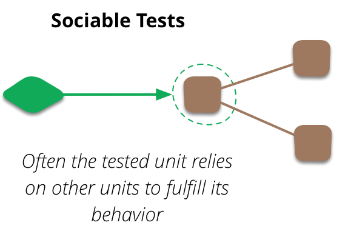
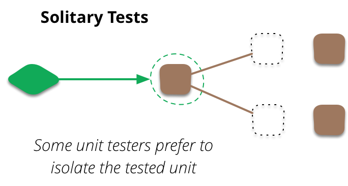
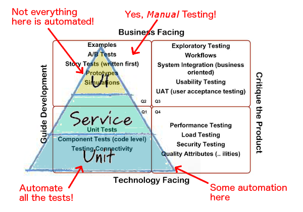
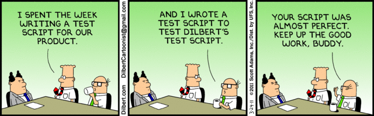

# Test Driven Development
## by Satya Sudheer

---

# Before We Start! 

- There is just Code. 
There is no good or bad.
- Everything we are going to 
discuss is already known to you!
- Most of them are subjective 
- Also debatable ..


---

# Agenda

- Basics
- Test Driven Development
- Coding Kata
- TDD Pitfalls
- Q&A

---

## What is a "Unit Test"

"it's a situational thing - the team decides what makes sense to be a unit for the purposes of their understanding of the system and its testing." - Martin Fowler

**A unit can be a method, function, class, group of classes.**


---

## Why Do We Write Unit Tests?

- Validate the System, Immediate Feedback
- Code Coverage
- Enable Refactoring
- Document the System Behavior
- Your Manager Told You To

---

## How many unit test do you write?

```csharp

public bool IsLoginSuccessful(string user, string password)
{
// ...
}

```
### As part of that, we will do

- State Verification
- Behaviour Verification 

---

## Unit tests isolate the unit of work from its real dependencies, such as time, network, database, threads, random logic, and so on.

### Unit Tests runs in memory & quick!

---

### Sociable Unit Test

- Sociable unit testing covers more functionality, easier to maintain, but harder to debug.



---

### Solitary Unit Test

- Solitary unit testing enables higher code coverage, promotes decoupling; executes faster than sociable unit testing and enables better software designs.



---

## What is a Boundary?

A boundary is "a database, a queue, another system, or even an ordinary class. if that class is 'outside' the area your trying to work with or are responsible for"

-- William E. Caputo

---

## Solitary unit testing motivates us towards pure functions while allowing us to keep the benefits of OOP.

---

## Test Doubles (Stunt Double)

- Dummy, just used to fill parameter lists.
- Fake objects actually have working implementations.
- Stubs provide canned answers to calls made during the test.
- Spies are stubs that also record some information. 
- Mocks are objects pre-programmed with expectations.

---

## Test Pyramid?

Its essential point is that you should have many more low-level unit tests than high level end-to-end tests running through a GUI.

In short, tests that run end-to-end through the UI are: brittle, expensive to write, and time consuming to run.


---

# Agile Testing Quadrants 

- Quadrant 1: Technology-facing tests that support the team
- Quadrant 2: Business-facing tests that support the team
- Quadrant 3: Business-facing tests that critique the product
- Quadrant 4: Technology-facing tests that critique the product



---

### Why Do We Write Unit Tests?
### [Revisting]

---

### To find "Bugs" quickly.  
### What if your "Unit Test" has bugs! 

 
---
## We need processes to help us do things well.

- Algorithms help you do arithmetic.
- Test Driven Development (TDD) helps you write software.
- Solitary Unit Testing helps you write well designed software.

---

## Test Driven Development
### Red - Green - Refactor

### Test-driven development (TDD), is a rapid cycle of testing, coding, and refactoring.

---

## TDD Cycle 
### Red - Green - Refactor

- Write a failing test for the next bit of functionality.
- Write the functional code until the test passes.
- Refactor both new and old code.

**TDD is not about "Testing", its more about "Development".**

---

## Prepare to Experince Awesomeness!
### FizzBuzz Kata (TDD)


---

## FizzBuzz

- Write a program that prints the numbers from 1 to 100. 
 - For multiples of three print “Fizz” instead of the number  
 - For the multiples of five print “Buzz”. 
 - For numbers which are multiples of both three and five print “FizzBuzz”.


---

## Noodle Break, Not Exactly! Git Help
  
- Fork & Getting Started
 
```
git clone <url>
cd kata
```

- Sync with remote repo

```
git pull origin master
```

- Adding files:

```
git add .
git commit -m "appropriate message"
git push origin master
```


---

### "Unit Test" Frameworks

- To Write Tests: Provides you an easy way to create & organize Tests.
- To Run Tests: Allows you to run all, or a group of tests or a single test.
- Feedback & Intergration: Immediate "Pass"/"Fail" feedback.

*Examples: MSUnit, JUnit, etc..*


---

## TDD: Step 1 
## Write a "Failing Test"

---

### How to Write Super Awesome "Unit Tests"
- Name - 3 Parts
    - Unit Of Work
    - Scenario
    - Expected behaviour
- Structure - 3 "A"s
    - Arrange
    - Act 
    - Assert


---

## Do's & Dont's!

- Zero logic
- One assertion per test.
- DAMP, not DRY
- Write "Solitary", avoide Social Tests!
- Don’t use variables, constants and complex objects in your assertions, rather stick with literals. 


---

## TDD: Step 2 
## Just code enough to "Pass the Test"

---

## Super Simple "Tip"
- Take Baby Steps: 
 - Rule 1: The next step to take should always be as small as possible.
 - Rule 2: Read "Rule 1" - Yes, as small as possible. 


---
## Why Baby Steps?

We will produce well-designed, well-tested, and well-factored code in small, verifiable baby steps.


---

## TDD: Step 3
## Improve the code by "Refactoring".

---

## Oh, Yeah Refactoring

- No "Logic Changes", Just moving the code around!
- Explore performant code options. 
- Keep watching your "Unit Tests"
- Remember "Baby Steps" Rule.


---

## Refactoring is Important!

The most common way that I hear to screw up TDD is neglecting the third step. Refactoring the code to keep it clean is a key part of the process, otherwise you just end up with a messy aggregation of code fragments.


---

## Its Treasure ..

Treat them as important as production code because they allow you to make changes confidently and correctly, improving your flexibility and maintainability over time.


---

## TDD Pitfalls

- Coverage as a goal.
- Not recognising what phase you’re in.
- Too many end-to-end tests.
- Too much noise, not enough signal.
- Not listening to the tests.
- Not tackling slow tests.
- Leaving broken tests.

---

## "TDD doesn't drive good design. TDD gives you immediate feedback about what is likely to be bad design." - Kent Beck
 
---
# Questions
(if any)


---

## The basic steps of TDD are easy to learn, but the mindset takes a while to sink in. 

### Until it does, TDD will likely seem clumsy, slow, and awkward. Give yourself two or three months of full-time TDD use to adjust.

---

## Coding Dojo
### To Become Awsome Developer


---

**Suggested Reading** 


---

## Image Credits

- [Dreamworks](http://www.dreamworks.com/) 
- [Martin Flower Bliki](https://martinfowler.com/bliki)


## Blogs

- [Martin Flower](https://martinfowler.com/bliki)
- [James Shore](http://www.jamesshore.com/Blog)

---

# Thank You :)
