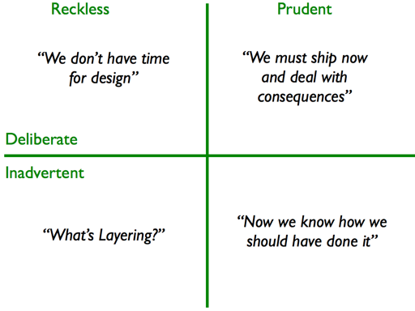

# Technical Debt
### .. Building Technical Wealth..

---

## Agenda
- What is Tech Debt? Where did it come from?
- What incurs Technical Debt?
- How to Measure Tech Debt?

---

## [fit] Technical Debt is a Metaphore 
---

Shipping first-time code is like going into debt. 

A little debt speeds development so long as it is paid back promptly with refactoring. 

The danger occurs when the debt is not repaid. Every minute spent on code that is not quite right for the programming task of the moment counts as interest on that debt. 

### ~ Ward Cunningham 

---
# [fit] Technical Debt is Good

---
# [fit] What qualifies for Tech Debt
- Is the code clean?
- Is the code tested?
- Is there a learning objective or event?
- Is there a plan for payback?
- Is the business truly informed?

*if any of the above questions is/are 'No', its not Tech Debt; Its something else.*

---

## Redundant, old, un used/dead or improperly written code is not Technical Debt

---
# [fit] Technical Debt Quadrant

---
# Technical Mess
- Disorderly accumulation, heap, or jumble
- A state of embarrassing confusion
- An unpleasant or difficult situation

---

# What's the strategy ?
- Never make an intentional Mess
- Monitor your "Technical Debt"
- Follow the *Boy Scout Rule*
- Remember quality is your responisbility
- Never ask permission to do your job correctly

---
# The Boy Scout Rule
## Always check a module in cleaner than when you checked it out.

---

# What to look?

- Code Coverage
- Code Complexity
- Coupling
- Maintainability

---
debt - https://www.pexels.com/photo/money-cash-euro-pay-36104/
code -https://www.pexels.com/photo/code-coding-computer-data-90807/
strategy- https://www.pexels.com/photo/hands-slow-motion-pot-brown-54216/
look - https://www.pexels.com/photo/person-woman-eyes-face-4636/

---
http://firstround.com/review/forget-technical-debt-heres-how-to-build-technical-wealth/
http://programmer.97things.oreilly.com/wiki/index.php/The_Boy_Scout_Rule